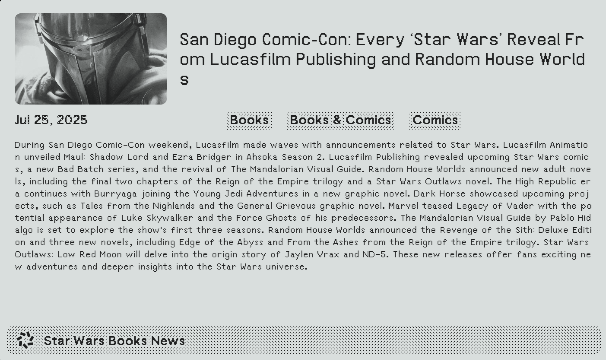

# Star Wars News Feed - TRMNL Plugin

A TRMNL plugin that displays Star Wars news from Star Wars News Net on trmnl devices, retrieving an image of the news article and a ChatGPT summary.

## What It Does

- **Live News Stream**  
  Pulls headlines and articles from Star Wars News Net’s RSS feed.

- **Automatic Image Extraction**  
  Detects and displays the Open Graph (OG) image from every news link.

- **AI-Powered Summaries**  
  Uses OpenAI’s GPT-3.5-turbo to read the full article text and craft a concise overview.

- **Multi-Layout Support**  
  Four display modes let you choose the perfect balance of image size and summary length for your screen.

- **E-ink Friendly**  
  Optimized for grayscale devices—no color, no problem.

---

## Developing

- Install [trmnlp](https://github.com/usetrmnl/trmnlp) for self-hosting a virtual trmnl device for plugin visualization.
- Add OpenAI API Key to `.trmnlp.yml`.
- Run `trmnlp serve`.

## RSS Feed Sources

The plugin currently pulls from:
- **Star Wars News Net - Books & Comics**: `https://www.starwarsnewsnet.com/category/books-comics/feed`

You can change the feed by modifying the `polling_url` in `settings.yml`:
- **All News**: `https://www.starwarsnewsnet.com/feed`
- **Films**: `https://www.starwarsnewsnet.com/category/films/feed`
- **TV Series**: `https://www.starwarsnewsnet.com/category/tv-series/feed`
- **Games & Toys**: `https://www.starwarsnewsnet.com/category/games-toys/feed`

